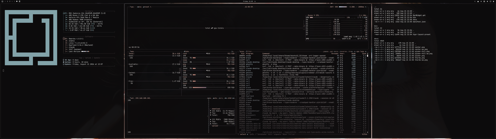
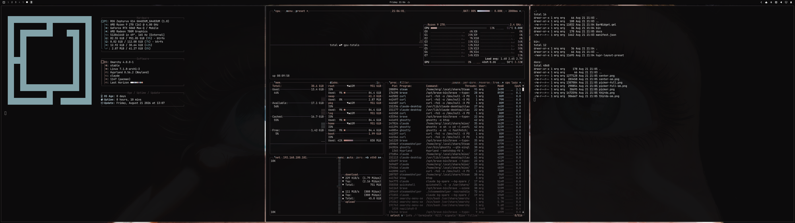
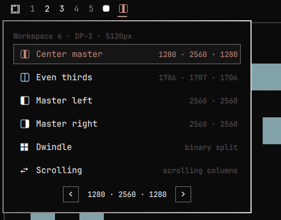
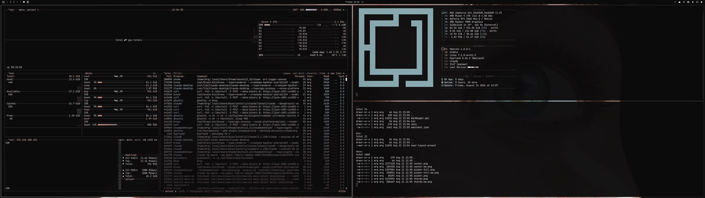

# Ultrawide layouts

An [Omarchy](https://omarchy.org/) bar plugin that switches the focused
workspace between Hyprland layout presets built for ultrawide panels — including
the one Hyprland can do but nobody sets up: **a centred master with a column on
each side.**



*Center master on a 5120×1440 panel: 1280 · **2560** · 1280.*

## Install

```bash
omarchy plugin add https://github.com/cromewar/omarchy-ultrawide-layouts.git --enable --yes
~/.config/omarchy/plugins/cromewar.ultrawide-layouts/bin/hypr-layout-preset setup
```

The first command adds the bar widget. `setup` enables stable layout slots and
binds their toggle to `SUPER + ALT + L`. It checks for a conflicting binding,
backs up both files it touches, reloads Hyprland, and rolls the edit back if the
reload reports an error. Use a different free chord with
`setup --key "SUPER + CTRL + L"`.

The icon appears in the left section of your bar; move it with
`omarchy bar move cromewar.ultrawide-layouts --section right`.

To update or remove:

```bash
omarchy plugin update cromewar.ultrawide-layouts
~/.config/omarchy/plugins/cromewar.ultrawide-layouts/bin/hypr-layout-preset teardown
omarchy plugin remove cromewar.ultrawide-layouts
```

Run `teardown` before removal. It unlocks every saved workspace, restores its
underlying preset, and removes only this plugin's marked blocks from
`~/.config/hypr/hyprland.lua` and `bindings.lua`.

## Presets

Widths shown are for a 5120px panel; the plugin computes them for whatever
monitor the focused workspace is on.

| Icon | Preset | Layout | Result |
|---|---|---|---|
|  | Center master | master, `orientation = center`, `mfact 0.5` | 1280 · **2560** · 1280 |
|  | Even thirds | master, `orientation = center`, `mfact 1/3` | 1706 · 1707 · 1706 |
|  | Master left | master, `orientation = left` | **2560** · 2560 |
|  | Master right | master, `orientation = right` | 2560 · **2560** |
| 󰕰 | Dwindle | dwindle | Omarchy's default binary split |
| 󰓡 | Scrolling | scrolling | niri-style side-scrolling columns |

Centred orientation only engages once there are two or more slaves
(`master:slave_count_for_center_master`), so a two-window workspace stays a plain
50/50 split rather than squashing itself into three — and below that threshold
the picker shows the two-column widths you will actually get, not the three it
would give with another window open.

The widths above are the ideal split of the panel. Real windows come out a little
narrower, because `gaps_out` is taken off each edge and `gaps_in` from between
every pair.



*Even thirds — three equal columns.*

## Using it



| Gesture | Effect |
|---|---|
| left click | open the picker |
| right click | next preset |
| middle click | snap back to the preset's ratio |
| scroll | grow / shrink the master column |
| click the current row | same as snap |
| `<` `>` in the picker | grow / shrink the master column |
| lock button / `SUPER + ALT + L` | toggle stable layout slots |

The picker header names the workspace, its monitor, and that monitor's width, so
the numbers next to each preset are the widths you will actually get.

## Stable layout slots

While unlocked, presets deliberately use Hyprland's native `master`, `dwindle`,
or `scrolling` algorithm. Closing a window makes that algorithm rebuild its
layout tree; promotion follows target/insertion order, not the visual side where
an app used to be. That is why a remaining browser can appear to jump from left
to right even though the preset plugin did not explicitly move it. A lock swaps
that workspace to the stable-slot provider described below.

Lock a workspace after arranging it the way you want. Its current tiled boxes
become slots: closing a fixed window leaves its space empty instead of moving a
different window across the screen. The rightmost captured column is dynamic by
default. Windows in that column compact vertically when one closes, and newly
opened tiled windows join it.

This gives the streaming arrangement from the motivating example:

```
OBS (fixed)  |  streamed app (fixed)  |  dynamic tools
```

Closing a tool on the right does not move OBS or the streamed app. Open another
tool and it fills the dynamic column. The lock card in the picker provides:

- **Unlock** — return to the underlying preset.
- **Recapture** — replace the saved slots with the boxes currently on screen.
- **Make focused column dynamic** — move dynamic behavior to the column that
  contains the focused tiled window.

The lock is per workspace and works over Center master, Even thirds, Master
left/right, and Dwindle. It needs at least two visible tiled windows and refuses
to start while a window is fullscreen. Scrolling is intentionally unsupported:
its defining behavior is a moving strip of columns, which conflicts with fixed
screen slots. Floating windows are ignored, and a Hyprland window group occupies
one tiled target.

Changing a preset while locked unlocks the workspace and applies the selected
preset. Resizing and snap controls are disabled until you unlock. To rearrange
the fixed anchors, unlock, arrange them, and lock again.

A regular `hyprctl reload` keeps the lock. A full Hyprland restart deliberately
restores the underlying preset: window identities do not survive a compositor
session, so replaying the old assignments could put unrelated windows in saved
slots. The saved lock is then treated as stale and can be removed by `prune`.

## Keybindings

The explicit `setup` command installs only the lock toggle, on
`SUPER + ALT + L` by default. Preset bindings remain opt-in. To put the preset
cycle on `SUPER + L` (replacing Omarchy's dwindle/scrolling toggle), add this to
`~/.config/hypr/bindings.lua`:

```lua
local presets = os.getenv("HOME") .. "/.config/omarchy/plugins/cromewar.ultrawide-layouts/bin/hypr-layout-preset"

hl.unbind("SUPER + L")
o.bind("SUPER + L", "Next layout preset", presets .. " --notify next")
o.bind("SUPER + SHIFT + L", "Layout preset picker",
  "omarchy-shell shell toggle cromewar.ultrawide-layouts '{}'")
```

`--notify` raises a toast naming the preset and its widths — a keypress has no
other feedback. The bar widget omits it, since the icon already shows the change.

Note that `SUPER + L` is Omarchy's "Toggle workspace layout" by default, which is
why the `hl.unbind` comes first. Nothing is lost: dwindle and scrolling are both
in the cycle.

## Settings

Per bar entry in `~/.config/omarchy/shell.json`, or through Setup › Plugins:

| Key | Default | Meaning |
|---|---|---|
| `showLabel` | `false` | show the preset name next to the icon |
| `mfactStep` | `0.025` | how far one scroll notch moves the master edge, as a fraction of screen width |

## How it works

Hyprland spreads a "layout" across three unrelated knobs:

| Knob | Where it lives | Scope |
|---|---|---|
| layout (`dwindle` / `master` / `scrolling`) | `general:layout`, or a workspace rule | global or per workspace |
| master `orientation` | `master:orientation`, or `layoutopt` on a workspace rule | global or per workspace |
| `mfact` — the master's share of the width | `master:mfact` for *new* workspaces; `layoutmsg mfact` for existing ones | per workspace, runtime only |

A preset is one fixed combination of the three. Layout and orientation persist as
workspace rules. `mfact` cannot be expressed as a rule at all and has to go
through the `layoutmsg` dispatcher, which acts on the focused workspace — which
is why every action here targets the focused workspace.

**The current preset is measured, not remembered.** The plugin reads
`tiledLayout` from Hyprland and derives `mfact` from the tiled columns. So it
stays correct after a manual `SUPER + ←/→` resize, a `SUPER + L` toggle, or a
fresh session — none of which announce themselves. When the master has been
dragged off-ratio the tooltip says `(resized)`, and one click on the current row
puts it back.

The master column is identified by its **position**, not its width. That
distinction is the whole ballgame: the master is only the widest window while
`mfact` is above 0.5 (left/right) or 1/3 (centre). Below that the widest column
is a *slave*, and reading it as the master gives you `1 - mfact`. `mfact` is then
the master column over the sum of the column widths, which cancels
`gaps_in`/`gaps_out` rather than leaving a systematic offset to be fudged later.

Some states carry no ratio at all — an empty workspace, a single window, a
fullscreen window, or a centre master below its slave threshold. There the
plugin reports nothing rather than a confident wrong number, and the preset
falls back to layout plus orientation, which are both still known. That is why
closing a workspace down to one window no longer loses your place in the cycle.

Orientation is the one thing that cannot be measured — `left` at `mfact 0.4` and
`right` at `0.6` produce identical column sets — and Hyprland does not report it
back (`hyprctl workspacerules` omits the field entirely). So it is read out of
the rule file below, and only trusted while that file still describes the live
layout.

> **Caveat:** if you set orientation through a monitor-wide rule you wrote by
> hand (`m[DP-3]` in `looknfeel.lua`) and the workspace has no rule file yet,
> there is no way to read that back, and the plugin will fall back to the global
> `master:orientation`. Applying any preset once fixes it permanently, because
> that writes the rule file, which is sourced last and wins.

Persistence goes to `~/.local/state/omarchy/workspace-layouts/<id>.lua`, the same
directory Omarchy's own `omarchy-hyprland-workspace-layout-toggle` writes to.
Sharing it is deliberate: both tools write the same file, so neither silently
loses to the other.

Stable slots use a small Hyprland Lua layout loaded by `setup`. The provider
captures Hyprland's logical boxes while it switches from the current algorithm,
then stores normalized geometry in
`~/.local/state/omarchy/layout-locks/<id>.lua`. Normalizing against the usable
workspace area means the shape scales when the monitor resolution, scale, or
reserved bar area changes. Fixed assignments remain after their window closes;
dynamic assignments are removed and restacked.

The generated workspace rule includes the compositor's instance signature. On a
config reload the signature still matches and the custom layout reloads its
state. After a full restart it does not match, so the same rule selects the saved
base layout instead. This is the automatic safety valve that prevents stale
window addresses from being reused.

`mfact` is the one thing that cannot survive a full Hyprland restart — a
workspace comes back with its orientation intact but on the default `master:mfact`.
One click on the current preset row restores it. Closing the master window has
the same effect: the promoted slave becomes a fresh master node at the global
default, so the preset stays but the ratio does not.



*Master left — the classic two-pane split, still useful for a wide editor.*

## CLI

All the compositor work is done by `bin/hypr-layout-preset`; the QML only renders
its JSON and calls its subcommands, so the bar and the CLI can never disagree
about what a preset means. It is usable on its own:

```
hypr-layout-preset list           # every preset + the widths it gives on this monitor
hypr-layout-preset status         # the focused workspace's current preset, as JSON
hypr-layout-preset get            # just the preset key
hypr-layout-preset set <key>
hypr-layout-preset next | prev | snap
hypr-layout-preset wider | narrower [step]
hypr-layout-preset lock | unlock | toggle-lock
hypr-layout-preset recapture-lock
hypr-layout-preset dynamic-focused
hypr-layout-preset setup [--key "SUPER + ALT + L"]
hypr-layout-preset teardown
hypr-layout-preset prune          # drop state for workspaces that no longer exist
```

Prefix any subcommand with `--notify` to raise a desktop notification naming the
result.

## Tests

The measurement suite uses captured compositor fixtures. The Lua provider has a
mocked layout context covering capture, vacancies, compaction, dynamic-column
reassignment, scaling, workspace isolation, and stale sessions. Setup and lock
lifecycle tests run with a temporary home and mocked Hyprland, so they never
touch the live desktop config.

```bash
./tests/run     # needs bash, jq, and lua
```

## Requirements

- Omarchy 4.0+ (the Quickshell `omarchy-shell` bar)
- Hyprland 0.56+ — needs Lua workspace rules with `layout_opts`, and the
  `scrolling` layout
- `jq`

It is not ultrawide-only. Every width is computed from the focused workspace's
monitor, so it works on a 16:9 screen too — the presets are just less interesting
there.

## License

MIT
